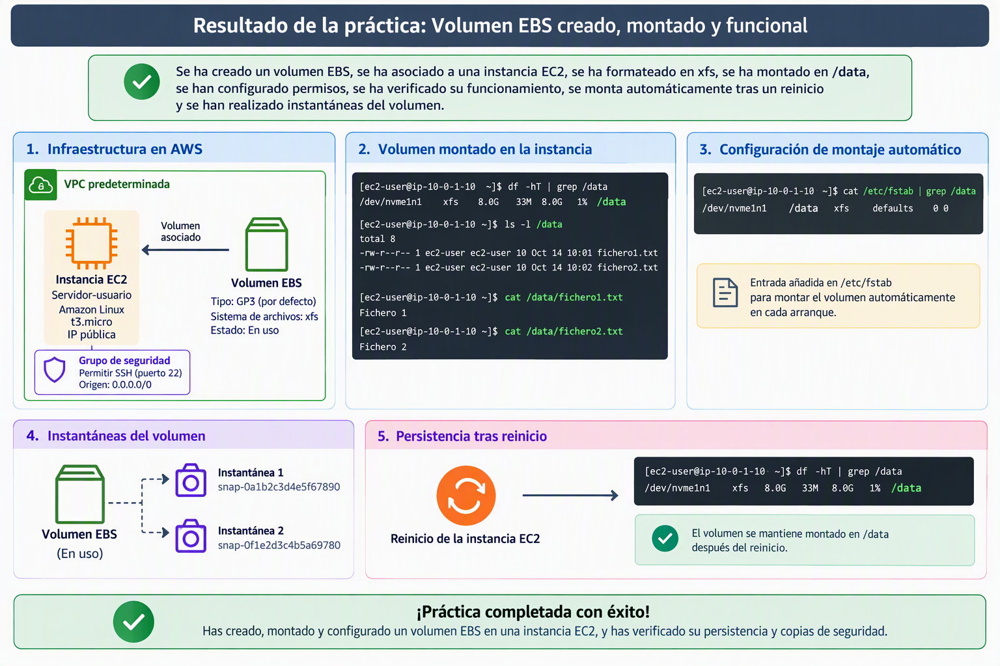

# Práctica 1: Creación y montaje de un Volumen EBS

Vamos a realizar una práctica en la que trabajaremos con varias fases del [ciclo de vida un disco EBS](https://docs.aws.amazon.com/es_es/ebs/latest/userguide/ebs-volume-lifecycle.html). crearemos una disco EBS que posteriormente agregaremos a una instancia EC2. Una vez vinculado el disco, le daremos formato y lo asociaremos a un punto de montaje. Modificaremos los permisos para que el usuario ec2-user tenga control completo sobre él. Una vez finalizada la operativa, modificaremos /etc/fstab para que el disco se monte automáticamente en cada arranque y haremos un par de instantáneas y restauraciones del disco. Esta práctica se hará toda en la consola de AWS.



## Creación de instancia EC2

1. Cree una instancia EC2 en la Región us-east-1:
   - Nombre: `Servidor-$username`
   - AMI: Amazon Linux más actual que sea Apta para la capa gratuita
   - Instancia t3.micro
   - Utiliza el par de claves vockey
   - Establece la máquina EC2 en la VPC predeterminada. Sin preferencias en AZ y Subred.
   - Asignación automática de IP pública: Habilitar
   - Crea una regla de seguridad llamada Permitir SSH abriendo el puerto 22 a cualquier origen
   - Deja el almacenamiento y el resto de parámetros por defecto y pulsa el botón Lanzar instancia.

## Crear volumen EBS, asociarlo y montarlo

2. Siguiendo el siguiente [manual](https://docs.aws.amazon.com/es_es/ebs/latest/userguide/ebs-creating-volume.html) vamos a crear un volumen Amazon EBS desde la consola. Ignora los pasos 10 y 11 y posteriormente asocialo a la instancia EC2 creada en el paso 1.
3. Una vez creado el volumen y asociado, sigue el siguiente manual para dar [formato y montarlo](https://docs.aws.amazon.com/es_es/ebs/latest/userguide/ebs-using-volumes.html) en el sistema Amazon Linux. Haz que el sistema de archivos sea xfs y que el punto de montaje sea /data.
4. Una vez tengamos la carpeta montada vamos a dar permisos al usuario actual para que pueda trabajar con la carpeta:

```sh
sudo chown -R $USER:$USER /data
chmod 750 /data
```

5. Comprueba que puedes leer y escribir en la carpeta. Por ejemplo creando algunos ficheros de texto con comandos y luego leyéndolos.  Ejemplo:

```sh
echo "Fichero 1" > /data/fichero1.txt
echo "Fichero 2" > /data/fichero2.txt

cat /data/fichero1.txt
```

6. Siguiendo los [pasos del manual](https://docs.aws.amazon.com/es_es/ebs/latest/userguide/ebs-using-volumes.html), haz que el dispositivo EBS se monte automáticamente después de un reinicio.

7. Reinicia la máquina EC2 y comprueba que el dispositivo está montado en la carpeta /data y que puedes leer y escribir en dicha carpeta.

## Creación de instantáneas

8. Ahora vamos a realizar una instatánea del disco. Para ello detén la instancia EC2 y creamos la instatánea para ello puedes seguir el siguiente [manual](https://docs.aws.amazon.com/es_es/ebs/latest/userguide/ebs-create-snapshot.html). Nombra a la instántanea como "Instántanea inicial".

9. Arrancamos de nuevo la máquina EC2 y una vez arrancada creamos ficheros nuevos en la carpeta `/data` donde se encuentra montado nuestra unidad EBS.

```sh
echo "Fichero 3" > /data/fichero4.txt
echo "Fichero 4" > /data/fichero4.txt

#Listamos los 4 ficheros que existen en /data
ls -l /data
```

10. Creamos una nueva instántanea que se llame "Segunda instántanea"

11. Una vez finalizada la instantánea arrancamos de nuevo la máquina EC2. Nos vamos a la carpeta /data y la vaciamos borrando todo el contenido que está dentro de ella.

```sh
# Añadiremos el parámetro -r si dentro de /data tenemos carpetas
rm /data/* 
#Comprobamos que está vacía la carpeta
ls /data
```

## Restauración de instantánea

Vamos a restaurar el volumen a partir de la instantánea. Para ello tenemos dos métodos:

- Crear un nuevo volumen a partir de la instantánea y copiar el contenido al volumen actual.

- Crear un nuevo volumen a partir de la instatánea y sustituir el disco EBS.

Vamos a utilizar el **segundo método** para restaurar la "Segunda instantanea". Para ello seguiremos el siguiente [manual](https://docs.aws.amazon.com/es_es/prescriptive-guidance/latest/backup-recovery/restore.html#restore-snapshot) pero teniendo en cuenta lo siguiente. 

> Para poder desvincular el volumen desde la consola AWS, es necesario **realizar el paso de desmontaje (paso d) en primer lugar**. Recuerde que estamos sustituyendo un disco que no es raíz.

1. Una vez finalizada la sustitución de discos, monta el nuevo disco y comprueba que en data están los 4 fichero que creamos. 

2. Comprueba si ha cambiado el blkid comparando el id del disco que nos da el comando `blkid` con el UUID que tenemos en `/etc/fstab`. Si ha cambiado, modifica fstab para que el nuevo volumen se remonte.

3. Reinicia el sistema y comprueba que el nuevo volumen está montado.

¡Felicidades! Has finalizado la práctica.
