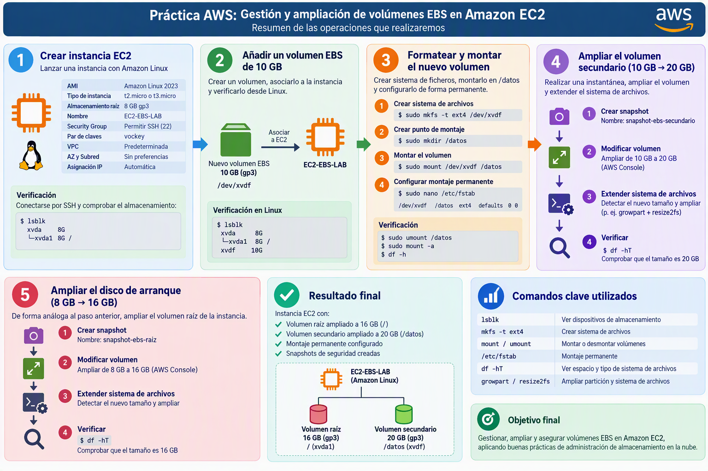

# Práctica AWS: Gestión y ampliación de volúmenes EBS en Amazon EC2

## Objetivos



En esta práctica trabajaremos los siguientes contenidos:

- Crear una instancia Amazon EC2 con Amazon Linux.
- Asociar un volumen EBS adicional.
- Identificar dispositivos de almacenamiento en Linux.
- Crear particiones y sistemas de ficheros.
- Montar volúmenes de forma permanente mediante `/etc/fstab`.
- Realizar instantáneas (snapshots) de seguridad.
- Ampliar un volumen EBS existente y extender el sistema de archivos.
- Ampliar el volumen raíz (disco de arranque) de una instancia EC2.

---

## Parte 1. Creación de la instancia EC2

### 1. Crear una instancia Amazon EC2

#### Características

| Parámetro           | Valor               |
| ------------------- | ------------------- |
| AMI                 | Amazon Linux 2023   |
| Tipo de instancia   | t2.micro o t3.micro |
| Almacenamiento raíz | 8 GB gp3            |
| Nombre              | EC2-EBS-LAB         |
| Security Group      | Permitir SSH (22)   |
| Par de claves       | vockey              |
| VPC                 | Predeterminada      |
| AZ y Subred         | Sin preferencias    |
| Asignación IP       | Automática          |

#### Verificación

Conectarse al EC2 mediante SSH o desde el botón Conectar de la consola:

Comprobar el almacenamiento disponible:

```sh
lsblk
```

Resultado esperado:

```sh
xvda    8G

└─xvda1 8G /
```

---

## Parte 2. Añadir un volumen EBS de 10 GB

### 1. Crear el volumen

Desde AWS Console:

**EC2 → Elastic Block Store → Volumes → Create Volume**

Parámetros:

| Configuración          | Valor               |
| ---------------------- | ------------------- |
| Tipo                   | gp3                 |
| Tamaño                 | 10 GB               |
| Zona de disponibilidad | La misma que la EC2 |

---

### 2. Asociar el volumen

Asociamos el volumen a la máquina EC2

Dispositivo sugerido:

`/dev/xvdf`

---

### 3. Verificar desde Linux

```
lsblk
```

Resultado aproximado:

```sh
xvda    8G

└─xvda1 8G /

xvdf   10G
```

---

## Parte 3. Formatear y montar el nuevo volumen

### 1. Crear el sistema de archivos

Guiándote por los pasos de la práctica anterior haz los siguientes pasos:

- Crear sistema de archivos

- Crear punto de montaje en `/datos`

- Montar el volumen

- Configurar el montaje permanente en `/etc/fstab`

---

### 2. Verificar `/etc/fstab`

```sh
sudo umount /datos
sudo mount -a
```

Comprobar:

```sh
df -h
```

Si el volumen vuelve a montarse correctamente la configuración es válida.

---

## Parte 4. Ampliación del volumen secundario

### Escenario

Vamos a ampliar el volumen secundario pasándolo de 10GB a 20GB. Antes de ampliarlo, haremos una instantánea que nos servirá de copia de seguridad:

1. Creamos snapshot con nombre `snapshot-ebs-secundario`

2. Modificamos el volumen para ampliarlo a 20GB. [Guía](https://docs.aws.amazon.com/es_es/ebs/latest/userguide/requesting-ebs-volume-modifications.html)

3. Ampliamos el sistema de archivos después de cambiar el tamaño del volumen. [Guía](https://docs.aws.amazon.com/es_es/ebs/latest/userguide/recognize-expanded-volume-linux.html?icmpid=docs_ec2_console).

4. Comprueba con el comando `df -hT` que se ha ampliado correctamente el sistema de archivos.

---

## Parte 5. Ampliación del disco de arranque

De forma análoga al apartado 4, vamos a duplicar el almacenamiento del disco de arranque pasándolo de 8GB a 16GB. Antes de ampliarlo, haremos una copia de seguridad.

1. Creamos snapshot con nombre `snapshot-ebs-secundario`

2. Modificamos el volumen para ampliarlo a 16GB. [Guía](https://docs.aws.amazon.com/es_es/ebs/latest/userguide/requesting-ebs-volume-modifications.html)

3. Ampliamos el sistema de archivos después de cambiar el tamaño del volumen. [Guía](https://docs.aws.amazon.com/es_es/ebs/latest/userguide/recognize-expanded-volume-linux.html?icmpid=docs_ec2_console).

4. Comprueba con el comando `df -hT` que se ha ampliado correctamente el sistema de archivos.
