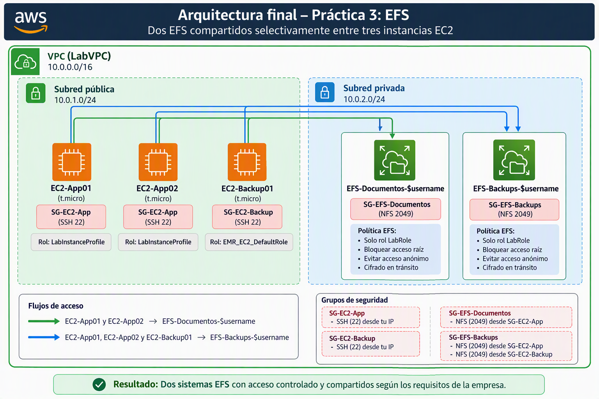
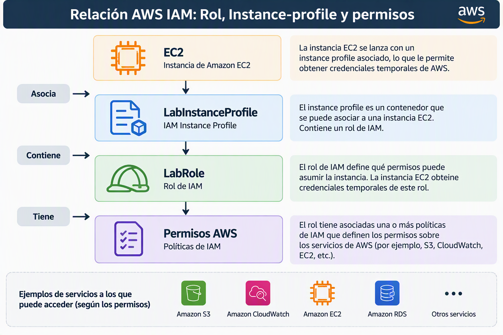

# Creación de dos EFS compartidos selectivamente entre tres instancias EC2

## Situación empresarial

La empresa **DataVision Consulting** desarrolla aplicaciones para entidades financieras y necesita centralizar la información compartida entre sus servidores.

La infraestructura está compuesta por tres instancias EC2:

| Instancia      | Función                               |
| -------------- | ------------------------------------- |
| `EC2-App01`    | Aplicación principal                  |
| `EC2-App02`    | Aplicación secundaria y procesamiento |
| `EC2-Backup01` | Servidor de backups y recuperación    |

La empresa tiene dos necesidades de almacenamiento claramente diferenciadas:

#### EFS-Documentos-$username

Se utilizará para almacenar:

- Manuales técnicos.
- Procedimientos internos.
- Documentación de proyectos.
- Informes compartidos.

Este almacenamiento solo debe ser accesible desde:

- `EC2-App01`
- `EC2-App02`

El servidor de backups no necesita acceder a esta información.

---

#### EFS-Backups-$username

Se utilizará para almacenar:

- Copias de seguridad de aplicaciones.
- Exportaciones de bases de datos.
- Ficheros de recuperación.

Este almacenamiento debe ser accesible desde:

- `EC2-App01`
- `EC2-App02`
- `EC2-Backup01`

---

## Objetivos

Al finalizar la práctica deberás ser capaz de:

✅ Crear dos sistemas de archivos EFS.

✅ Configurar los permisos de acceso mediante Security Groups.

✅ Montar un EFS en dos servidores y otro EFS en tres servidores.

✅ Verificar la compartición de datos.

✅ Automatizar los montajes mediante fstab.

---

## Arquitectura final



---

## Fase 0: Crear LabVPC

Utiliza el script que existe en la página [Introducción](../#script-que-crea-vpc-con-subred-publica-y-subred-privada) para crear una VPC con subredes pública y privada. Todas las máquinas EC2 y Sistemas EFS se montarán en esta VPC.

Revisa también en la parte de Introducción que texto debes poner en vez de [$username](../#la-variable-username).

## Fase 1: Crear las instancias EC2

Crear tres instancias Amazon Linux 2023:

- `EC2-App01`

- `EC2-App02`

- `EC2-Backup01`

Con estas características

- AMI: Amazon Linux más actual que sea Apta para la capa gratuita

- Instancia t{x}.micro de capa gratuita más actual

- Utiliza el par de claves vockey

- Establece la máquina EC2 en la VPC `LabVPC`, subred `PublicSubnet`. Sin preferencia de AZ.

- Asignación automática de IP pública: Habilitar

- Deja el almacenamiento y el resto de parámetros por defecto y pulsa el botón Lanzar instancia.

- Asocia:

  - A las máquinas `EC2-App0x` el rol `LabInstanceProfile` 

  - A la máquina `EC2-Backup01` el rol `EMR_EC2_DefaultRole`.

En un **entorno real crearíamos un rol** para las máquinas con acceso a documentos y otro para la que sólo va a tener acceso a la parte de backup pero **los laboratorios de AWS no nos dejan crear roles** por lo que tenemos que conformarnos con los predefinidos.

- Par de claves `vockey`.

---

## Fase 2: Configurar Security Groups

### Paso 1. Crear SG-EC2-App

Asignar a:

- `EC2-App01`

- `EC2-App02`

Permitir:

| Tipo | Puerto |
| ---- | ------ |
| SSH  | 22     |

---

### Paso 2. Crear SG-EC2-Backup

Asignar a:

- `EC2-Backup01`

Permitir:

| Tipo | Puerto |
| ---- | ------ |
| SSH  | 22     |

---

### Paso 3. Crear SG-EFS-Documentos

Siguiendo la siguiente [guía](https://docs.aws.amazon.com/es_es/efs/latest/ug/creating-using-create-fs.html).

Permitir:

| Tipo | Puerto |
| ---- | ------ |
| NFS  | 2049   |

Origen:

SG-EC2-App

De esta forma únicamente las instancias `EC2-App01` y `EC2-App02` podrán montar este EFS.

---

### Paso 4. Crear SG-EFS-Backups

Permitir:

| Tipo | Puerto |
| ---- | ------ |
| NFS  | 2049   |

Origen:

`SG-EC2-App`

`SG-EC2-Backup`

Con esta configuración, las tres máquinas tendrán acceso.

---

## Fase 3: Crear los sistemas EFS

### Paso 5. Crear EFS-Documentos-$username

#### Paso 1:

- Nombre: `EFS-Documentos-$username`
- Deshabilita las copias de seguridad automáticas para evitar cargos adicionales

Resto de parámetros por defecto

#### Paso 2:

- Elegimos nuestra VPC `LabVPC` y como subred `PrivateSubnet` evitando así que máquinas de fuera de AWS puedan acceder a nuestro EFS. 
- Sólo usamos ipv4 
- Asociamos el grupo de seguridad `SG-EFS-Documentos`. Con esto **securizamos a nivel de conexión el EFS**

#### Paso 3:

Vamos a seguir las recomendaciones de seguridad para proteger un sistema EFS. Para ello vamos a marcar las siguientes opciones:

- Impedir el acceso raíz por defecto

- Evitar el acceso anónimo

- Aplicar el cifrado en tránsito para todos los clientes

Se nos creará una política JSON. Esta política va a permitir conectarse a **cualquier instancia que no sea anónima** pero nosotros sólo queremos que se puedan conectar las instancias EC2 con el Rol de IAM asociado `LabInstanceProfile`. Para conseguir esto tenemos que modificar el json generado en el statement que cuyo action es `elasticfilesystem:ClientWrite` y tiene una condición booleana llamada `elasticfilesystem:AccessedViaMountTarget` con valor `true`. En esa política veremos que el Principal (a quién aplica esta política) será algo similar a esto:

```json
"Principal": {
    "AWS": "*"
}
```

Deberemos cambiarlo por el ARN del Rol IAM que está contenido dentro de LabInstanceProfile. 



Para conocer ese ARN, abrimos la consola EC2 y escribimos el comando:

```sh
aws sts get-caller-identity
```

Nos devolverá un resultado parecido a éste:

```json
{
    "UserId": "AROAZKKMNFFGGZLH45IBB:i-0b15f0dfd746aa0d1",
    "Account": "640647244108",
    "Arn": "arn:aws:sts::640647244108:assumed-role/LabRole/i-0b15f0dfd746aa0d1"
}
```

Ese ARN es un ARN temporal de STS. Si reiniciamos la consola o accedemos desde otro equipo, veremos que posiblemente el ARN haya variado. Revisa el documento "[ARN temporal de STS frente al ARN del rol IAM en EC2 y EFS](/anexo-sts-role)" para entender las implicaciones antes de seguir.

El nombre de un ARN temporal de STS sigue el siguiente formato:

`arn:aws:sts::<cuenta>:assumed-role/<nombre-Rol>/<Sesion-i>`

Por lo tanto de este ejemplo podemos asumir:

- Cuenta: 640647244108

- Rol: `LabRole`

- Sesión-i: i-0b15f0dfd746aa0d1

El **ARN permanente del rol LabRole** sería el siguiente:
`arn:aws:iam::640647244108:role/LabRole`

Ese el ARN que deberemos pegar en nuestra política quedando dicha política así (hemos modificado la línea 9):

```json
{
    "Version": "2012-10-17",
    "Id": "efs-policy-wizard-b03eb5c8-3637-4ff2-b023-8223d07bcef1",
    "Statement": [
        {
            "Sid": "efs-statement-solo-labrole",
            "Effect": "Allow",
            "Principal": {
                "AWS": "arn:aws:iam::640647244108:role/LabRole"
            },
            "Action": "elasticfilesystem:ClientWrite",
            "Resource": "arn:aws:elasticfilesystem:us-east-1:640647244108:file-system/fs-00a7abbeaf2dc7551",
            "Condition": {
                "Bool": {
                    "elasticfilesystem:AccessedViaMountTarget": "true"
                }
            }
        },
        {
            "Sid": "efs-statement-6917ef70-df8f-46db-8e1d-1c70e5e8844b",
            "Effect": "Deny",
            "Principal": {
                "AWS": "*"
            },
            "Action": "*",
            "Resource": "arn:aws:elasticfilesystem:us-east-1:640647244108:file-system/fs-00a7abbeaf2dc7551",
            "Condition": {
                "Bool": {
                    "aws:SecureTransport": "false"
                }
            }
        }
    ]
}
```

Esta política sigue teniendo un problema, cualquier Rol podrá montar el sistema de ficheros. Para evitar esto, vamos a añadir el permiso `elasticfilesystem:ClientMount` dentro de esta política (se ha añadido en la línea 13). Así sólo las máquinas con el Rol `LabRole` (o un instance profile que lo contenga como `LabInstaceProfile`) podrán montar este volumen en una máquina EC2.

La política que quedará será parecida a esta (haz las modificaciones comentadas sobre la tuya ya que esta no funcionará si la copias y pegas directamente)

```json
{
    "Version": "2012-10-17",
    "Id": "efs-policy-wizard-b03eb5c8-3637-4ff2-b023-8223d07bcef1",
    "Statement": [
        {
            "Sid": "efs-statement-solo-labrole",
            "Effect": "Allow",
            "Principal": {
                "AWS": "arn:aws:iam::640647244108:role/LabRole"
            },
            "Action": [
                "elasticfilesystem:ClientWrite",
                "elasticfilesystem:ClientMount"
            ],
            "Resource": "arn:aws:elasticfilesystem:us-east-1:640647244108:file-system/fs-00a7abbeaf2dc7551",
            "Condition": {
                "Bool": {
                    "elasticfilesystem:AccessedViaMountTarget": "true"
                }
            }
        },
        {
            "Sid": "efs-statement-6917ef70-df8f-46db-8e1d-1c70e5e8844b",
            "Effect": "Deny",
            "Principal": {
                "AWS": "*"
            },
            "Action": "*",
            "Resource": "arn:aws:elasticfilesystem:us-east-1:640647244108:file-system/fs-00a7abbeaf2dc7551",
            "Condition": {
                "Bool": {
                    "aws:SecureTransport": "false"
                }
            }
        }
    ]
}
```

Con estas políticas hemos conseguido los siguiente:

- El acceso debe realizarse a través de un Mount Target (`AccessedViaMountTarget`).
- El tráfico debe ir cifrado (`tls`).
- El cliente debe autenticarse mediante IAM (`iam`).
- El principal autenticado debe ser el rol `LabRole`.
- El rol tiene permisos de montaje (`ClientMount`) y escritura (`ClientWrite`).

Una cosa que tenemos que tener en cuenta. Cuando usemos una máquina EC2 que asuma el Rol `LabRole`, vamos ver que tenemos el permiso `elasticfilesystem:ClientRootAccess`. Podemos comprobarlo creando un fichero con sudo y viendo que el dueño del archivo es root:root. En un sistema sin root squashing el usuario sería nobody.

##### ¿Por qué podemos actuar como root (no_root_squashing) pese a no dar el permiso en el recurso?

Según la [documentación de red y permisos de Amazon EFS](https://docs.aws.amazon.com/es_es/efs/latest/ug/accessing-fs-nfs-permissions.html#accessing-fs-nfs-permissions-root-user), por defecto, el "root squashing" está desactivado (`no_root_squash`).

Esto significa que Amazon EFS trata nativamente a cualquier usuario con UID 0 (root) como el usuario administrador raíz y se salta las comprobaciones de permisos. 

Para activar el `root squashing` (es decir, degradar al usuario root a un usuario anónimo sin privilegios), debemoss quitarle explícitamente el permiso `elasticfilesystem:ClientRootAccess`.

| Configuración en el Servidor                      | Usuario en el Cliente | UID enviado | UID con el que se escribe en el Servidor | ¿Tiene control total?                                     |
| ------------------------------------------------- | --------------------- | ----------- | ---------------------------------------- | --------------------------------------------------------- |
| **`root_squash`** *(Por defecto en NFS estándar)* | `root`                | `0`         | **`65534` (`nobody`)**                   | No, se le trata como un usuario invitado sin privilegios. |
| **`no_root_squash`** *(Por defecto en AWS EFS)*   | `root`                | `0`         | **`0` (`root`)**                         | Sí, tiene acceso total como superusuario en el servidor.  |

En realidad, al menos para un primer acceso en el que creemos estructuras de carpeta y asociemos permisos, es necesario tener acceso `root` ya que en el directorio / del EFS el usuario `root` es el propietario del recurso montado. Vamos a provechar esto cuando montemos por primera vez los EFS para crear las estructuras de carpetas y luego **denegaremos** explíticamente el root squashing. 

Existe algunas casuísticas muy contadas no es necesario habilitar el root squashing pero en la mayoría de sistemas la recomendación es habilitarlo por defecto.

 ---

## Fase 4: Instalar amazon-efs-utils

En las tres EC2:

```sh
sudo yum install -y amazon-efs-utils
```

---

## Fase 5: Montar EFS-Documentos-$username

### ¿Qué máquinas se pueden conectar a EFS-Documentos-$username?

- Cuando creamos el punto de acceso del EFS asociamos el grupo de seguridad `SG-EFS-Documento`.

- En las políticas del EFS hemos establecido:

```json
{
    "Sid": "efs-statement-dc4dd5c9-1532-47de-8772-f2220a8bfffe",
    "Effect": "Allow",
    "Principal": {
        "AWS": "arn:aws:iam::640647244108:role/LabRole"
    },
    "Action": [
        "elasticfilesystem:ClientWrite",
        "elasticfilesystem:ClientMount"
    ],
    "Resource": "arn:aws:elasticfilesystem:us-east-1:640647244108:file-system/fs-0c4e49d543c970398",
    "Condition": {
        "Bool": {
            "elasticfilesystem:AccessedViaMountTarget": "true"
        }
    }
}
```

Por lo tanto sólo nos podremos conectar desde máquinas cuyo SG sea `SG-EC2-App` y que además tengan el Rol `LabRole`. En nuestra práctica esto lo cumplen las máquinas `EC2-App01` y `EC2-App02`.

### En EC2-App01 y EC2-App02

Monta la carpeta raíz del `EFS-Documentos-$username` en las máquinas `EC2-App01` y `EC2-App02`.

Fíjate en el punto 3.1 de este [tutorial](https://docs.aws.amazon.com/es_es/efs/latest/ug/wt1-getting-started.html) para obtener el nombre DNS del sistema `EFS-Documentos-$username`. Como usamos `amazon-efs-utils` también podrías poner sólo el ID del EFS. Fíjate que en comando añadimos `-o tls,iam` para obligar a usar TLS en la conexión y enviar los datos del Rol IAM asociado a la instancia.

> Ten en cuenta que si acabas de crear el sistema EFS es posible que tengas que esperar varios minutos para que el comando `mount`funcione incluso aunque en la consola se muestre el sistema EFS como `disponible`. Eso se debe a que las resoluciones DNS tardan varios minutos en propagarse.

```sh
# Crear directorio:
sudo mkdir /documentos

#Montar:
sudo mount -t efs -o tls,iam fs-id:/ /documentos

#Comprobar: Debemos ver una entreada montada en /documentos
df -h
```

### Creación de carpetas en EFS-Documentos-$username y asignación de permisos a las mismas.

Desde el equipo `Ec2-App01`, vamos a crear una carpeta `compartida` con lectura y escritura para todo el mundo y una carpeta `documentacion` con permisos de solo lectura para todos los usuarios y de lectura escritura para el usuario local documentador que crearemos y que tendrá permisos totales sobre ella. En un entorno real el usuario documentador debería ser un usuario de un AD o LDAP corporativo.

Además vamos a crear una carpeta compartida en la que cualquier usuario pueda leer y escribir.

```sh
# Creamos a documentador y le establecemos un password
sudo adduser documentador
sudo passwd documentador

# Creamos la carpeta como su (/documentos tiene como propietario a 
# documentador:documentador y sólo el propietario puede escribir en ella)
sudo mkdir /documentos/documentacion
sudo chown documentador:documentador /documentos/documentacion

# Creamos la carpeta compartida y le damos permisos 777 para que todo
# el mundo pueda leer y escribir en ella
sudo mkdir /documentos/compartida
sudo chmod 777 /documentos/compartida
```

### Prueba de funcionamiento

Con usuario `ec2-user` en máquina `Ec2-App01`

```sh
echo "Manual de despliegue"" > /documentos/compartida/manual.txt
# Listamos para comprobar que se ha creado el documento
ls -l /documentos/compartida

# Intentamos crear un fichero en documentacion, se espera error de permisos
echo "Manual infraestructura" /documentos/documentacion/infraestructura.txt

# Cambiamos al usuario documentador y creamos el fichero infraestructura y
# el documento arquitectura

su documentador
echo "Manual infraestructura" > /documentos/documentacion/infraestructura.txt
echo "Manual arquitectura" > /documentos/documentacion/arquitectura.txt

# Comprobamos que se han creado los ficheros
ls -l /documentos/documentacion
```

Ahora iniciamos sesión con el usuario `ec2-user` en la máquina `Ec2-App02`

```sh
# Comprobamos que existen los ficheros de la carpeta compartida
# en modo lectura
ls -l /documentos
```

Veremos que están la carpeta `compartida` con propietario `root:root` y la carpeta `documentacion` con usuario y grupo numérico. Esto es porque al ser un usuario local de la máquina `Ec2-App01`, no tiene la información de dicho usuario. En un entorno de Sistema en red tipo LDAP o AD veríamos correctamente el nombre.

Mostramos el contenido del fichero `/documentos/compartida/manual.txt` y que también podemos leer el fichero `/documentos/documentacion/infraestructura.txt`

```sh
cat /documentos/compartida/manual.txt
cat /documentos/documentacion/infraestructura.txt
```

Vemos que nos muestra el contenido de los ficheros sin problema.

Ahora intentaremos crear un fichero en la subcapeta documentacion y obtendremos error:

```sh
touch /documentos/documentacion/test-permisos.txt
```

Sin embargo si intentamos crear ese mismo fichero con sudo nos va a dejar

```sh
sudo touch /documentos/documentacion/test-permisos.txt
```

#### ¿Por qué hemos podido crear un fichero en una carpeta de sólo lectura?

Al estar activado el `no_root_squashing`, cualquier root de una máquina local puede trabajar como `root` en las carpetas EFS. Esto implica que un usuario malicioso o un sistema infectado **podría cambiar permisos, cambiar propietarios o modificar y borrar el contenido de nuestro sistema de ficheros. Cuando trabajemos con EFS o con cualquier sistema NFS tenemos que evaluar si esta característica es necesario en nuestra implementación. 

La recomendación habitual es habilitar el `root_squashing`. 

#### Habilitar `root_squashing` en EFS-Documentos-$username

Si todas las pruebas funcionaron correctamente, podemos suponer que ya tenemos la estructura de carpetas montadas para nuestro sistema y podemos proceder a cerrar el acceso root squashing. Para ello bastaría con **añadir** la siguiente política al EFS modificando el Resource por el ARN de nuestro `EFS-Documentos-$username`:

```json
{
    "Sid": "ForzarRootSquashExplicito",
    "Effect": "Deny",
    "Principal": "*",
    "Action": "elasticfilesystem:ClientRootAccess",
    "Resource": "arn:aws:elasticfilesystem:us-east-1:640647244108:file-system/fs-0c4e49d543c970398"
}
```

Una vez añadida la política, desmontamos y montamos de nuevo el EFS y veremos que, si ahora queremos crear un el fichero `/documentos/documentacion/nuevo-test-permisos.txt` utilizando al superusuario con `sudo`, vamos a tener un error de permisos. Ejemplo del comando:

```sh
sudo touch /documentos/documentacion/nuevo-test-permisos.txt
```

La carpeta `compartida` tenía permisos 777 por lo que vamos a poder crear ficheros en ella como `root`. Fíjate también que si creamos un fichero en la carpeta y luego listamos el contenido:

```sh
# Creamos el fichero
sudo touch /documentos/compartida/test-root-compartida.txt

# Listamos el contenido de /documentos/compartida
ls -l /documentos/compartida
```

¿Qué usuario aparece como propietario del fichero `/documentos/compartida/test-root-compartida.txt`? Debería aparecer como `nobody`. [Explicación](#por-qu-podemos-actuar-como-root-no_root_squashing-pese-a-no-dar-el-permiso-en-el-recurso).

---

### Validación de seguridad

Vamos a intentar montar `EFS-Documentos-$username` desde `EC2-Backup01`

```sh
sudo mkdir /documentos

sudo mount -t efs fs-DOCUMENTOS:/ /documentos
```

¿Pudiste montar la carpeta? ¿Cuál es el motivo? Explica qué cambios habría que hacer para que se pudiera realizar el montaje `respuestaQ1.txt`

---

## Fase 6. Crear `EFS-Backups-$username`

Una vez realizados los pasos anteriores, vais a realizar de **forma autónoma** el resto de la implementación. Además de las fuentes que consideréis oportunas, podéis ayudaros de la documentación oficial y de los pasos realizados con anterioridad para crear EFS-Documentos-$username y montarlo en las máquinas cliente. Cuando en el nombre de una captura se ponga `.ext` quiere decir que será la extensión propia de la captura (Usualmente jpg o png)

Implementaciones a realizar:

1. Crear `EFS-Backups-$username`
   - VPC `LabVPC`, subred `PrivateSubnet`.

   - El destino de montaje tendrá como SG asociado `SG-EFS-Backups` para permitir las conexiones tanto de las máquinas EC2-App0x como de la máquina EC2-Backup01.

   - Las políticas de seguridad serán las siguientes:

     - El acceso debe realizarse a través de un Mount Target (`AccessedViaMountTarget`).

     - El tráfico debe ir cifrado (`tls`).

     - El principal autenticado debe ser el rol `LabRole` o `EMR_EC2_DefaultRole`.

     - Ambos roles tienen permisos de montaje (`ClientMount`) y escritura (`ClientWrite`).
2. Montar `EFS-Backups-$username` en `EC2-App01`. Asegúrate de que también tienes montado `EFS-Documentos-$username` en `/documentos` en esta máquina antes de realizar las tareas:
   - Creamos carpeta /backups en la máquina
   - Montamos la raíz de EC2-backup01 en /backups
   - Una vez montada creamos la siguiente estructuras de carpetas:
     - /backups/ec2-user Propietario ec2-user:ec2-user permisos 700
     - /backups/general Propietario root:root permisos 777
   - Una vez comprobados los permisos activamos `no_root_squashing`
   - Como usuario ec2-user creamos los ficheros file1.txt, file2.txt en `/backups/ec2-user`. Hacemos captura del comando `ls -l /backups/ec2-user`. Nombre del fichero `01-ec2-user-ls-b-ec2.ext`
   - Nos pasamos al usuario `documentador` e intentamos hacer `ls -l /backups/ec2-user`. Captura de la salida del comando. Nombre fichero: `02-documentador-ls-b-ec2.ext`
   - También como documentador, creamos los ficheros `documentador1.txt` y `documentador2.txt` dentro la carpeta `/backups/general/documentador` que habremos creado previamente. Captura de la salida del comando `ls -l /backups/general/documentador`. Nombre del fichero `03-documentador-ls-general.ext`
   - Ejecutamos el comando `sudo touch /backups/ec2-user/root-file.txt`. Captura de la salida del comando. Nombre del fichero `04-root-create-file-ec2.ext`
   - Ejecutamos el comando `sudo touch /backups/general/root-file.txt`. Captura de la salida del comando. Nombre del fichero `05-root-create-file-general.ext`
   - Ejecuta el comando `df -h` Captura de la salida del comando. Nombre del fichero `06-df-App01.ext`
   - (Opcional) Modifica `/etc/fstab` para que ambos EFS se monten automáticamente cuando arrancamos el equipo. Si se hace adjuntar captura de comando `cat /etc/fstab`. Nombre del archivo: `99-Opc-fstab.ext`
3. Montar `EFS-Backups-$username` en `EC2-App01`. Asegúrate de que también tienes montado `EFS-Documentos-$username` en `/documentos` en esta máquina antes de realizar las tareas:
   - Creamos carpeta /backups en la máquina
   - Montamos la raíz de EC2-backup01 en /backups
   - Ejecuta el siguiente comando: `ls -l /backups`. Captura de la salida del comando. Nombre del fichero `10-backups-ls.ext`
   - Ejecuta el siguiente comando: `ls -l /documentos`. Captura de la salida del comando. Nombre del fichero `11-documentos-ls.ext`
4. Montar `EFS-Backups-$username` en `EC2-Bck01`:
   - Creamos carpeta /backups en la máquina
   - Montamos la raíz de EC2-backup01 en /backups
   - Ejecuta el siguiente comando: `ls -l /backups`. Captura de la salida del comando. Nombre del fichero `20-backups-ls.ext`

## Formato entrega

Fichero zip con nombre `practicaUd3-$username.zip`. Contenido:

- Carpeta `capturas`: Con las capturas del paso 6

- Fichero políticas-efs-documentos.json con el contenido de las políticas del servidor EFS-Documentos-$username.

- Fichero politicas-efs-backup.json con el contenido de las políticas del servidor `EFS-Backups-$username`.

- Carpeta SG. Con las siguientes capturas de los siguientes Security Groups:

  - Captura de listado completo de reglas seguridad. Nombre del fichero: `listado-SG.ext`

  - Captura de las reglas de entrada de `SG-EC2-App`. Nombre de fichero: `SG-EC2-App.ext`

  - Captura de las reglas de entrada de `SG-EC2-Backup`. Nombre de fichero: `SG-EC2-Backup.ext`

  - Captura de las reglas de entrada de `SG-EFS-Backup`. Nombre de fichero: `SG-EFS-Backup.ext`

  - Captura de las reglas de entrada de `SG-EFS-Documentos`. Nombre de fichero: `SG-EFS-Documentos.ext`

- Fichero `respuestaQ1.txt`
