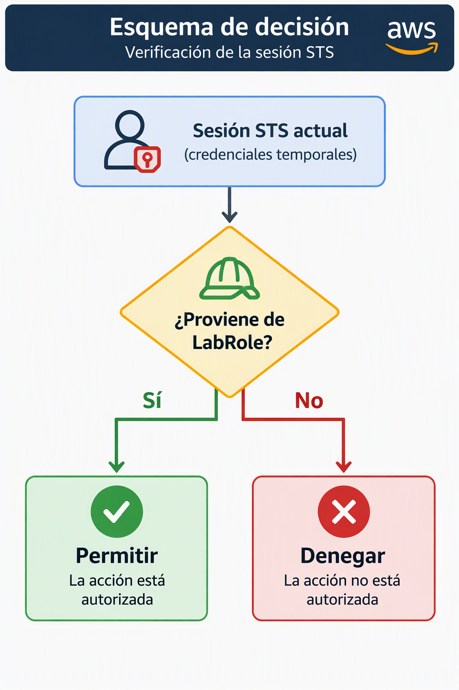

# ARN temporal de STS frente al ARN del rol IAM en EC2 y EFS

## Introducción

Cuando asociamos un rol IAM a una instancia EC2 es habitual utilizar el comando:

```bash
aws sts get-caller-identity
```

para comprobar la identidad con la que AWS está autenticando nuestras peticiones.

Sin embargo, muchos administradores se sorprenden al observar que el ARN devuelto no coincide con el ARN del rol configurado en la instancia. En lugar de devolver algo parecido a:

```text
arn:aws:iam::640647244108:role/LabRole
```

AWS devuelve un ARN con este formato:

```text
arn:aws:sts::640647244108:assumed-role/LabRole/i-07bf297d124eaa14d
```

Esto no es un error. Se debe al funcionamiento interno de IAM Roles, Instance Profiles y AWS STS.

---

## Cómo obtiene permisos una instancia EC2

### 1. Creación del rol IAM

En primer lugar se crea un rol IAM.

Por ejemplo:

```text
LabRole
```

con ARN:

```text
arn:aws:iam::640647244108:role/LabRole
```

Este rol contiene las políticas que determinan qué acciones puede realizar la instancia.

Por ejemplo:

```json
{
  "Effect": "Allow",
  "Action": [
    "elasticfilesystem:ClientMount",
    "elasticfilesystem:ClientWrite"
  ],
  "Resource": "*"
}
```

---

### 2. Creación del Instance Profile

Las instancias EC2 *no pueden asociarse directamente a* un rol IAM.

AWS utiliza un objeto intermedio denominado **Instance Profile**.

Por ejemplo:

```text
LabInstanceProfile
```

con ARN:

```ext
arn:aws:iam::640647244108:instance-profile/LabInstanceProfile
```

Su única misión es transportar uno varios roles hacia la instancia EC2.

La relación lógica es:


---

### 3. Lanzamiento de la instancia EC2

Cuando arrancamos una instancia EC2 asociándole el Instance *rofile:

```text
LabInstanceProfile
```

AWS detecta que dicho perfil contiene el rol:

```text
LabRole
```

y automáticamente genera credenciales temporales para la instancia.

Estas credenciales son proporcionadas por AWS STS (Security Token Service).

---

### 4. Asunción del rol mediante STS

Internamente AWS ejecuta un proceso equivalente a:

```text
AssumeRole(LabRole)
```

El resultado es una sesión temporal basada en el rol.

Por ello la identidad real utilizada por la instancia ya no es:

```text
arn:aws:iam::640647244108:role/LabRole
```

sino:

```text
arn:aws:sts::640647244108*assumed-role/LabRole/i-07bf297d124eaa14d
```

donde:

```textile
LabRole
```

es el nombre del rol asumido:

```text
i-07bf297d124eaa14d
```

es el identificador de la sesión.

---

## Por qué aws sts get-caller-identity devuelve un ARN STS

Cuando ejecutamos:

```bash
aws sts get-caller-identity
```

AWS responde con la identidad efectiva que está firmando las peticiones en ese momento.

Por tanto, el resultado suele ser:

```json
{
  "Account": "6406*7244108",
  "Arn": "arn:aws:sts::640647244108:assumed-role/LabRole/i-07bf297d124eaa14d"
}
```

El servicio no devuelve el ARN original del rol porque la llamada está siendo realizada por una sesión temporal creada por STS.

Desde el punto de vista de AWS la identidad activa es:

```text
assumed-role/LabRole/...
```

y no el recurso IAM original.

---

## Por qué no debemos utilizar el ARN de STS en las políticas

Resulta tentador copiar el ARN obtenido con:

```bash
aws sts get-caller-*dentity
```

y utilizarlo como Principal en una política de EFS:

```json
{
  "Principal": {
    "AWS": "arn:aws:sts::640647244108:assumed-role/LabRole/i-07bf297d124eaa14d"
 *}
}
```

Sin embargo no es una buena práctica.

El motivo es que dicho ARN representa una sesión temporal concreta.

Si:

- se reinicia la instancia,
- cambian las credenciales,
- se crea otra EC2 con el mismo rol,

aparecerá un ARN STS diferente.

Por ejemplo:

```text
arn:aws:sts::640647244108:assumed-role/LabRole/i-0abc123456789def
```

La política dejaría de coincidir con la nueva sesión.

---

## ¿Qué ARN debemos utilizar en las políticas?

La práctica correcta consiste en utilizar el ARN permanente del rol IAM.

En nuestro caso:

```text
arn:aws:iam::640647244108:role/LabRole
```

Por ejemplo:

```json
{
  "Principal": {
    "AWS": "arn:aws:iam::640647244108:role/LabRole"
  }
}
```

De esta forma cualquier sesión STS derivada de ese rol será considerada válida.

AWS evaluará:



---

## Caso práctico con EFS

Supongamos una política EFS como la siguiente:

```json
{
 *"Effect": "Allow",
  "Principal": {
    "AWS": "arn:aws:iam::640647244108:role/LabRole"
  },
  "Action": [
    "elasticfilesystem:ClientMount",
    "elasticfilesystem:ClientWrite"
  ],
  "Resource": "arn:aws:elasticfilesystem:us-east-1:640647244108:file-system/fs-xxxxxxxx"
}
```

Cuando una EC2 monte el sistema de archivos usando:

```bash
sudo mount -t efs -o tls,iam fs-xxxxxxxx:/ /documentos
```

el helper de EFS enviará un token firmado con las credenciales temporales STS.

EFS comprobará:

1. Qué rol generó dichas credenciales.
2. Si dicho rol coincide con el Principal autorizado.
3. Si dispone de los permisos requeridos.
4. Si se cumplen las condiciones adicionales (TLS, Mount Target, etc.).

Aunque la EC2 se autentique mediante un ARN STS temporal, la evaluación se realiza contra el rol IAM que originó la sesión.

Por ello el Principal correcto sigue siendo:

```text
arn:aws:iam::640647244108:role/LabRole
```

y no el ARN temporal obtenido mediante `get-caller-identity`.

---

## Resumen

- Una EC2 no utiliza directamente un rol IAM, sino un Instance Profile.
- El Instance Profile permite a AWS asociar un rol a la instancia.
- AWS STS genera credenciales temporales para dicho rol.
- `aws sts get-caller-identity` muestra la sesión STS activa, no el ARN original del rol.
- El ARN devuelto suele tener el formato:

```text
arn:aws:sts::ACCOUNT:assumed-role/ROL/SESION
```

- Las políticas de recursos (como EFS) deben referenciar el ARN permanente del rol:

```text
arn:aws:iam::ACCOUNT:role/ROL
```

- **Nunca debe utilizarse el ARN temporal de STS como principal** permanente de una política porque representa únicamente una sesión concreta.
