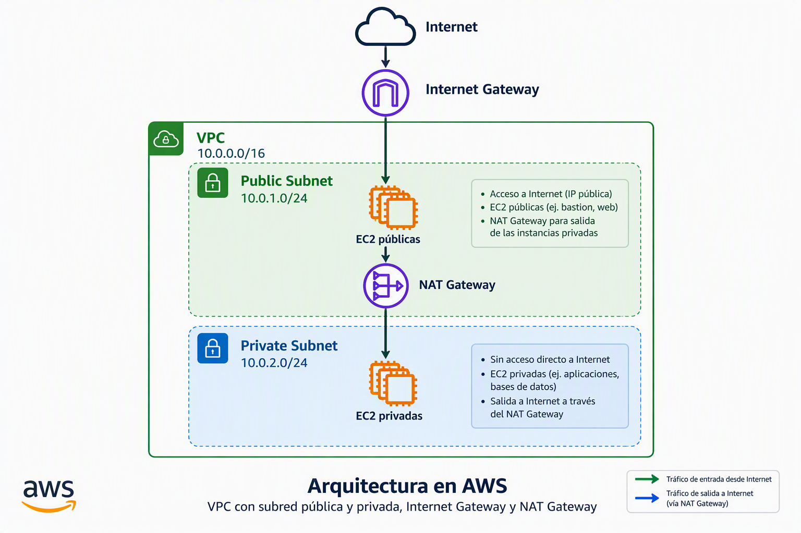

# Prácticas UD3

Dentro de esta sección vamos a detallar las prácticas de la unidad didáctica 3 en la que trabajaremos administrando almacenamiento de bloques y ficheros. 

## Consideraciones comunes a todas las prácticas de esta unidad

### La variable $username

Recuerda que cuando pongamos `$username` en el nombre sustituimos por la primera letra de nuestro nombre (si tenemos varios nombres, sólo usaremos la primera letra del primer nombre), primera letra del apellido y segundo apellido completo (si no tienes segundo apellido, pon el primer apellido completo). Por ejemplo, en mi caso que soy Rafael González Centeno `$username = rgcenteno`Esto permitirá ver la autoría de las prácticas

### Script que crea VPC con subred pública y subred privada



```sh
#!/bin/bash

set -e

####################################
# VARIABLES
####################################

REGION="us-east-1"

vpc_name="LabVPC"
vpc_cidr="10.0.0.0/16"

public_subnet="PublicSubnet"
public_cidr="10.0.1.0/24"

private_subnet="PrivateSubnet"
private_cidr="10.0.2.0/24"

####################################
# CREAR VPC
####################################

echo "Creando VPC..."

VPC_ID=$(aws ec2 create-vpc \
    --cidr-block "$vpc_cidr" \
    --region "$REGION" \
    --query 'Vpc.VpcId' \
    --output text)

aws ec2 wait vpc-available \
    --vpc-ids "$VPC_ID" \
    --region "$REGION"

aws ec2 create-tags \
    --resources "$VPC_ID" \
    --tags Key=Name,Value="$vpc_name" \
    --region "$REGION"

echo "VPC creada: $VPC_ID"

####################################
# HABILITAR DNS
####################################

aws ec2 modify-vpc-attribute \
    --vpc-id "$VPC_ID" \
    --enable-dns-support \
    --region "$REGION"

aws ec2 modify-vpc-attribute \
    --vpc-id "$VPC_ID" \
    --enable-dns-hostnames \
    --region "$REGION"

####################################
# OBTENER AZ
####################################

AZ=$(aws ec2 describe-availability-zones \
    --region "$REGION" \
    --query 'AvailabilityZones[0].ZoneName' \
    --output text)

echo "AZ seleccionada: $AZ"

####################################
# CREAR SUBRED PÚBLICA
####################################

PUBLIC_SUBNET_ID=$(aws ec2 create-subnet \
    --vpc-id "$VPC_ID" \
    --cidr-block "$public_cidr" \
    --availability-zone "$AZ" \
    --region "$REGION" \
    --query 'Subnet.SubnetId' \
    --output text)

aws ec2 create-tags \
    --resources "$PUBLIC_SUBNET_ID" \
    --tags Key=Name,Value="$public_subnet" \
    --region "$REGION"

aws ec2 modify-subnet-attribute \
    --subnet-id "$PUBLIC_SUBNET_ID" \
    --map-public-ip-on-launch

echo "Subred pública: $PUBLIC_SUBNET_ID"

####################################
# CREAR SUBRED PRIVADA
####################################

PRIVATE_SUBNET_ID=$(aws ec2 create-subnet \
    --vpc-id "$VPC_ID" \
    --cidr-block "$private_cidr" \
    --availability-zone "$AZ" \
    --region "$REGION" \
    --query 'Subnet.SubnetId' \
    --output text)

aws ec2 create-tags \
    --resources "$PRIVATE_SUBNET_ID" \
    --tags Key=Name,Value="$private_subnet" \
    --region "$REGION"

echo "Subred privada: $PRIVATE_SUBNET_ID"

####################################
# INTERNET GATEWAY
####################################

IGW_ID=$(aws ec2 create-internet-gateway \
    --region "$REGION" \
    --query 'InternetGateway.InternetGatewayId' \
    --output text)

aws ec2 attach-internet-gateway \
    --internet-gateway-id "$IGW_ID" \
    --vpc-id "$VPC_ID" \
    --region "$REGION"

echo "Internet Gateway: $IGW_ID"

####################################
# ROUTE TABLE PÚBLICA
####################################

PUBLIC_RT_ID=$(aws ec2 create-route-table \
    --vpc-id "$VPC_ID" \
    --region "$REGION" \
    --query 'RouteTable.RouteTableId' \
    --output text)

aws ec2 create-route \
    --route-table-id "$PUBLIC_RT_ID" \
    --destination-cidr-block 0.0.0.0/0 \
    --gateway-id "$IGW_ID" \
    --region "$REGION"

aws ec2 associate-route-table \
    --route-table-id "$PUBLIC_RT_ID" \
    --subnet-id "$PUBLIC_SUBNET_ID" \
    --region "$REGION"

####################################
# EIP PARA NAT
####################################

EIP_ALLOC_ID=$(aws ec2 allocate-address \
    --domain vpc \
    --region "$REGION" \
    --query 'AllocationId' \
    --output text)

echo "Elastic IP: $EIP_ALLOC_ID"

####################################
# NAT GATEWAY
####################################

NAT_GW_ID=$(aws ec2 create-nat-gateway \
    --subnet-id "$PUBLIC_SUBNET_ID" \
    --allocation-id "$EIP_ALLOC_ID" \
    --region "$REGION" \
    --query 'NatGateway.NatGatewayId' \
    --output text)

echo "Esperando a que el NAT Gateway esté disponible..."

aws ec2 wait nat-gateway-available \
    --nat-gateway-ids "$NAT_GW_ID" \
    --region "$REGION"

echo "NAT Gateway: $NAT_GW_ID"

####################################
# ROUTE TABLE PRIVADA
####################################

PRIVATE_RT_ID=$(aws ec2 create-route-table \
    --vpc-id "$VPC_ID" \
    --region "$REGION" \
    --query 'RouteTable.RouteTableId' \
    --output text)

aws ec2 create-route \
    --route-table-id "$PRIVATE_RT_ID" \
    --destination-cidr-block 0.0.0.0/0 \
    --nat-gateway-id "$NAT_GW_ID" \
    --region "$REGION"

aws ec2 associate-route-table \
    --route-table-id "$PRIVATE_RT_ID" \
    --subnet-id "$PRIVATE_SUBNET_ID" \
    --region "$REGION"

####################################
# RESUMEN
####################################

echo ""
echo "=========================================="
echo "VPC              : $VPC_ID"
echo "IGW              : $IGW_ID"
echo "Public Subnet    : $PUBLIC_SUBNET_ID"
echo "Private Subnet   : $PRIVATE_SUBNET_ID"
echo "Public RT        : $PUBLIC_RT_ID"
echo "Private RT       : $PRIVATE_RT_ID"
echo "Elastic IP       : $EIP_ALLOC_ID"
echo "NAT Gateway      : $NAT_GW_ID"
echo "=========================================="
```
